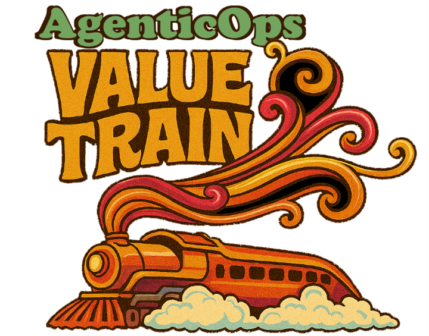

# AgenticOps Value Train™

*This repo is a work in progres as we think about solving agentic AI engineering problmes. The repo isstill very much experimental and messy. Things may be deleted or changed at any moment, sometimes daily. Use at your own risk and share what your thinking about in AI Engineering and AgenticOps.*

*NOTE: We started in Python, but C# is the future of this repo. We're using Python for now because it's the most popular language for AI and ML. But @charleslbryant is a C# dev till he dies, so we're going there :).*

<div align="center">

</div>

## All Aboard the Value Train! 

Welcome to the station where AI development meets structured delivery! The AgenticOps Value Train™ transforms chaotic ML engineering into a well-orchestrated journey from opportunity to production. No more missed connections or derailed projects, just reliable, automated, and auditable value delivery.

---

## What is the Value Train?

**AgenticOps Value Train™** is an AI-driven value delivery system that implements a structured methodology for managing AI agent development workflows across the entire ML pipeline. Think of it as the "DevOps for AI Agents", bringing the same rigor,discipline, automation, and reliability that transformed software development to AI-human collaborative workflows.

### Core Value Proposition

- For ML engineering teams who struggle with chaotic, manual ML project workflows
- The Value Train is an AI-driven development methodology  
- That provides structured agent-human collaboration with automated quality gates
- Unlike traditional MLOps platforms that focus only on technical pipeline
- We orchestrate the entire development workflow from opportunity assessment through continuous improvement

## 🎯 Key Features

### Agent-Centric Design
Seven specialized AI agents work together seamlessly:
- **Conductor** - Orchestrates the entire value stream
- **Onboarder** - Manages pre-engagement and client readiness  
- **Lab** - Handles data profiling, extraction, and model experimentation
- **Studio** - Designs model architecture and production systems
- **Ops** - Provisions infrastructure, monitoring, and deployment
- **Evaluator** - Validates quality and tracks performance metrics
- **Improver** - Optimizes features and manages retraining cycles

### Phase-Gate Methodology
Structured progression through 18 defined phases with automated validation:
- **Pre-Engagement**: Opportunity Triage → Discovery → Readiness → Scope → Logistics
- **Delivery**: Data Sources → Extraction → Preparation → Exploration → Feature Engineering → Architecture → Training → Validation → Deployment → Monitoring → Evaluation → Performance Analysis → Improvement → Retraining

### Auto-Pilot Orchestration
Autonomous issue selection, workspace management, and quality enforcement reduces manual task management andcoordination overhead. Moving cards, logging time, not today.

### Session-Based Context Management
Persistent context across agent handoffs and phase transitions ensures no information loss and complete audit trails.

## 🚀 Quick Start

### Prerequisites
- Python 3.8+
- Git with LFS support
- GitHub CLI (`gh`)

### Installation

```bash
# Clone the repository
git clone https://github.com/charleslbryant/agenticops-value-train.git
cd agenticops-value-train

# Set up development environment
make venv
source venv/bin/activate
make install

# Run tests to verify installation
make test
```

### Your First Journey

1. **Initialize a new project session:**
   ```bash
   /kick
   ```

2. **Create your first value stream:**
   ```bash
   /plan
   ```

3. **Start the Auto-Pilot:**
   ```bash
   /drive
   ```

## 🛤️ Project Structure

```
agenticops-value-train/
├── assets/                    # Logos and visual assets
├── docs/                      # Documentation and specifications
│   ├── architecture/          # System architecture and ADRs
│   ├── product/              # Product vision and strategy
│   ├── rules/                # Operating procedures and checklists
│   └── session-context/      # Active session management
├── pipelines/                # Phase definitions and workflow configs
├── scripts/                  # Automation scripts and helpers
├── templates/                # Reusable templates and scaffolding
├── tests/                    # Test suites and validation
└── tickets/                  # Active work tickets and artifacts
```

## 📊 Success Metrics

*This is based on a non-scientific, non-rigorous, and non-peer-reviewed account of my own experience using the Value Train underlying principles and methodology to build the Value Train (so meta).*

- **3x faster** time-to-deployment for ML models through automated workflows
- **95%** of projects pass quality gates on first attempt through standardized processes
- **80%** of routine tasks automated through AI agent coordination
- **10x** more concurrent ML projects supported with same team size (pure assumption that feels possible)
- **100%** traceability of decisions and artifacts for regulatory requirements (maybe 999.999%?)

## 🔧 Technology Stack

- **Backend**: Python for automation scripts and workflow orchestration
- **Configuration**: YAML for pipeline definitions and session state
- **Documentation**: Markdown with YAML front-matter for structured metadata
- **Integration**: GitHub API for issue management and automation, Git hooks for quality gates
- **Infrastructure**: Cloud-agnostic design with container support

## 📚 Documentation

- **[Product Vision](docs/product/product-vision.md)** - Strategic direction and goals
- **[Product Strategy](docs/product/product-strategy.md)** - Development roadmap and go-to-market
- **[Architecture Guide](docs/architecture/architecture.md)** - System design and technical details
- **[Value Train Specification](docs/product/agenticops-value-train.md)** - Complete methodology reference
- **[Contributing Guide](docs/contribute.md)** - How to join our crew

## 🎫 Contributing

Ready to climb aboard and contribute to the Value Train? We'd love to have you join our crew! Whether you're a seasoned conductor or just getting your ticket punched, there's a place for you on this journey.

**[📖 Read our Contributing Guide](docs/contribute.md)** to learn how to:
- Get your development environment on track
- Follow our quality standards and workflows  
- Submit your first pull request
- Become a certified Value Train engineer

## 📈 Roadmap

### Current Status: Infrastructure Foundation (Phase 1)
- ✅ Core agent roles and responsibilities defined
- ✅ Pipeline phases and mode system implemented
- ✅ Session management and context tracking
- 🚧 Auto-Pilot implementation (in progress)
- 🔜 Risk registry and governance features

## 🤝 Community & Support

- **Issues**: [GitHub Issues](https://github.com/charleslbryant/agenticops-value-train/issues)
- **Discussions**: [GitHub Discussions](https://github.com/charleslbryant/agenticops-value-train/discussions)
- **Documentation**: [Wiki](https://github.com/charleslbryant/agenticops-value-train/wiki)

## 📄 License

This project is licensed under the MIT License - see the [LICENSE](LICENSE) file for details.

---

## 🚂 Ready to Depart?

The Value Train is now boarding! Whether you're looking to streamline your ML development process, implement structured AI agent workflows, or just curious about the future of AI-driven development, we invite you to:

1. ⭐ **Star this repository** to stay updated on our journey
2. 🔍 **Explore the documentation** to understand the full methodology  
3. 🛠️ **Try the Quick Start** to experience the Value Train firsthand
4. 🤝 **Join our community** and help shape the future of AI development

*All aboard! Next stop: Structured, scalable, and successful AI delivery.*

---

**AgenticOps Value Train™** - *Making AI development as reliable as clockwork* ⚙️🚂
