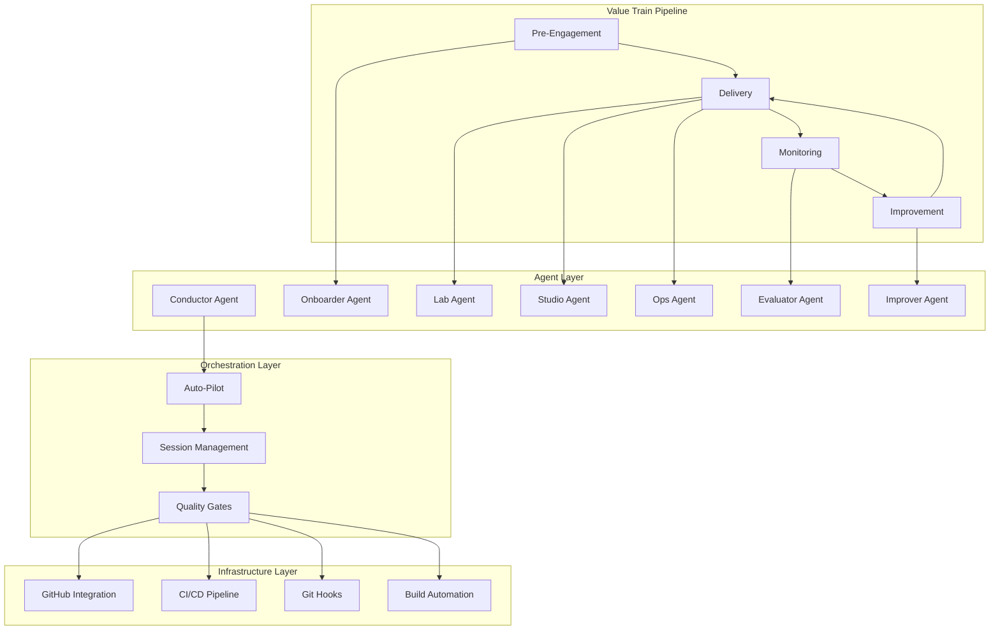
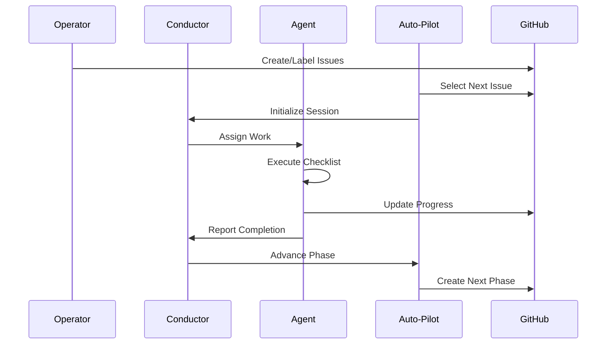
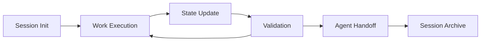

# AgenticOps Value Train™ Architecture

## Product Overview

**AgenticOps Value Train™** is an AI-driven value delivery system that implements a structured methodology for managing AI agent development workflows across the entire ML pipeline. The platform provides a comprehensive framework for digital, data, IoT, and AI product development with phase-based workflows, agent orchestration, and continuous improvement cycles.

## Core Purpose
- Enable autonomous AI agent operation across ML development workflows
- Provide structured phase-based progression from opportunity assessment through deployment and improvement
- Ensure consistent quality gates and artifact management throughout the development lifecycle
- Support scalable, multi-agent coordination with minimal human intervention
- Maintain complete traceability of decisions, artifacts, and progress across all phases

## Architecture Overview

The AgenticOps Value Train™ follows a modular, agent-centric architecture where specialized AI agents operate within bounded contexts (modes) to complete specific phases of the ML development lifecycle. The system emphasizes automation, quality gates, and structured handoffs between agents and phases.

### High-Level Architecture



### Key Components

```
agenticops/
├── docs/                   # Documentation and session management
│   ├── architecture/       # ADRs and system design
│   ├── rules/             # Workflow and task management rules
│   ├── session-context/   # Active session state
│   └── templates/         # Reusable templates
├── scripts/               # Python automation scripts
├── tests/                 # Comprehensive test suite
├── config/               # Pipeline and system configuration
├── .github/              # GitHub Actions and templates
└── .claude/              # Claude Code command integration
```

## Agent Architecture

### Agent Roles and Responsibilities

#### Conductor Agent
- **Purpose**: Orchestrates the entire Value Train pipeline, coordinates handoffs between agents
- **Dependencies**: Session management, GitHub API, all other agents
- **Responsibilities**: 
  - Phase progression decisions
  - Cross-agent coordination
  - Pipeline state management
  - Issue routing and prioritization

#### Onboarder Agent  
- **Purpose**: Manages pre-engagement activities including opportunity assessment and client readiness
- **Dependencies**: CRM tools, document templates, assessment frameworks
- **Responsibilities**:
  - Opportunity qualification
  - Client readiness assessment
  - Scope definition and pricing
  - Contract and logistics coordination

#### Lab Agent
- **Purpose**: Handles data operations including profiling, extraction, cleaning, and model experimentation
- **Dependencies**: Data sources, Python/R environments, MLflow, Jupyter
- **Responsibilities**:
  - Data profiling and quality assessment
  - Feature engineering
  - Model training and experimentation
  - Retraining pipeline execution

#### Studio Agent
- **Purpose**: Designs model architecture, inference systems, and production deployment strategies
- **Dependencies**: Architecture tools, deployment platforms, monitoring systems
- **Responsibilities**:
  - Model architecture design
  - Inference pipeline development
  - Production deployment planning
  - System integration design

#### Ops Agent
- **Purpose**: Manages infrastructure provisioning, deployment, monitoring, and operational concerns
- **Dependencies**: Cloud platforms, IAM systems, monitoring tools, cost management
- **Responsibilities**:
  - Infrastructure provisioning
  - Deployment automation
  - Monitoring and alerting
  - Cost optimization and security

#### Evaluator Agent
- **Purpose**: Defines success metrics, validates model performance, and ensures quality standards
- **Dependencies**: Evaluation frameworks, business metrics, testing tools
- **Responsibilities**:
  - Success criteria definition
  - Model performance validation
  - Quality assurance
  - Stakeholder feedback integration

#### Improver Agent
- **Purpose**: Optimizes system performance through continuous improvement and feedback analysis
- **Dependencies**: Performance data, error logs, feedback systems, retraining tools
- **Responsibilities**:
  - Performance analysis
  - Root cause investigation
  - Improvement recommendations
  - Retraining coordination

## Key Design Decisions

### Technology Choices
- **Python**: Primary language for scripts and automation due to ML ecosystem compatibility
- **YAML**: Configuration and session state format for human readability and tool support
- **Markdown**: Documentation format with YAML front-matter for structured metadata
- **GitHub**: Version control, issue tracking, and project management platform
- **Makefile**: Build automation for consistent cross-platform development

### Architectural Patterns
- **Agent-Oriented Architecture**: Specialized agents with clear responsibilities and boundaries
- **Mode-Based Execution**: Bounded contexts with specific tools and validation rules
- **Session-Based State Management**: Persistent context across interactions and handoffs
- **Phase-Gate Methodology**: Sequential progression with validation at each transition
- **Event-Driven Orchestration**: Auto-Pilot responds to GitHub events and issue state changes

## Integration Points

### GitHub Integration
- **Purpose**: Version control, issue tracking, project management, and automation triggers
- **Method**: GitHub API, webhooks, GitHub Actions
- **Dependencies**: GitHub repository, API tokens, webhook configuration

### CI/CD Pipeline
- **Purpose**: Automated testing, quality validation, and deployment
- **Method**: GitHub Actions workflows with quality gates
- **Dependencies**: Test suite, linting tools, deployment targets

### Claude Code Integration
- **Purpose**: AI agent execution environment and command interface
- **Method**: Slash commands, structured prompts, tool integration
- **Dependencies**: Claude Code CLI, command configurations, session management

### External ML Tools
- **Purpose**: Model training, experiment tracking, and deployment
- **Method**: API integration and artifact management
- **Dependencies**: MLflow, cloud ML platforms, monitoring services

## Development Approach

### Current Implementation Status
- **Core Infrastructure**: ✅ Complete (pipeline config, session management, basic scripts)
- **Mode Checklists**: ✅ Complete (all 9 modes with comprehensive checklists)
- **Python Scripts**: ✅ Complete (check_todo, check_artifacts, conductor_update, migrate_session)
- **Test Suite**: ✅ Complete (107 tests with 99% pass rate)
- **Build Automation**: 🚧 In Progress (Makefile implementation planned)
- **Git Hooks**: ⏳ Planned (pre-commit and pre-push validation)
- **Auto-Pilot**: ⏳ Planned (autonomous issue selection and execution)
- **Risk Registry**: ⏳ Planned (structured risk tracking and mitigation)

### Testing Strategy
- **Unit Tests**: Comprehensive coverage for all Python scripts and utilities
- **Integration Tests**: End-to-end validation of agent workflows and handoffs
- **Quality Gates**: Automated linting, formatting, and validation in CI/CD
- **Coverage Goals**: Maintain >90% test coverage with focus on critical paths

## File Organization

### Project Structure
```
agenticops/
├── .github/              # GitHub Actions, issue templates, PR templates
├── .claude/              # Claude Code command configurations
├── config/               # Pipeline and system configuration
├── docs/                 # All documentation
│   ├── architecture/     # System design and ADRs
│   ├── rules/            # Workflow and process rules
│   ├── session-context/  # Active session state management
│   └── templates/        # Reusable document templates
├── scripts/              # Python automation and utility scripts
├── tests/                # Comprehensive test suite
├── tickets/              # Auto-Pilot workspace isolation (future)
├── requirements.txt      # Python dependencies
├── pytest.ini           # Test configuration
├── Makefile              # Build automation (planned)
└── CLAUDE.md            # Primary instructions for Claude Code
```

### Key Files
- **CLAUDE.md**: Central instructions and project context for Claude Code
- **config/pipeline.yml**: Pipeline phase definitions, modes, and artifact specifications
- **docs/session-context/ACTIVE_SESSION.md**: Current session state with YAML front-matter
- **docs/rules/task-management.md**: GitHub issue hierarchy and workflow rules
- **docs/agenticops-value-train.md**: Complete Value Train specification

## Future Architecture Considerations

### Planned Enhancements
- **Auto-Pilot Implementation**: Autonomous issue selection, workspace management, and execution (Q1 2024)
- **Risk Registry Operationalization**: Automated risk tracking and mitigation workflows (Q1 2024)
- **Advanced Monitoring**: Real-time pipeline health and agent performance metrics (Q2 2024)
- **Multi-Project Support**: Scaling to handle multiple concurrent Value Train instances (Q2 2024)

### Scalability
- **Agent Parallelization**: Multiple agents operating on different phases simultaneously
- **Workspace Isolation**: Ticket-based folder structure prevents conflicts during parallel execution
- **Resource Management**: Cloud-native deployment for handling increased throughput
- **State Partitioning**: Session management that scales across multiple concurrent projects

### Quality Assurance
- **ADR Documentation**: All architectural decisions recorded in `/docs/architecture/adr/`
- **Test Coverage**: Maintain >90% coverage with focus on critical automation paths
- **Code Quality**: Automated enforcement via git hooks and CI/CD pipeline
- **Error Handling**: Comprehensive error recovery with operator notification and manual override

## Workflow Architecture

### Phase Progression Flow


### Session State Management


## Context for Development Sessions

### Essential Context
1. **Product**: AI-driven development workflow automation with specialized agent coordination
2. **Technology Stack**: Python, YAML, Markdown, GitHub Actions, Claude Code
3. **Current Focus**: Infrastructure completion and Auto-Pilot implementation
4. **Architecture**: Agent-centric with mode-based execution and session state management

### Session Startup Context
1. Read `/docs/agenticops-value-train.md` for complete Value Train specification
2. Read `/docs/session-context/ACTIVE_SESSION.md` for current session state
3. Read `/docs/value-train-alignment-plan.md` for implementation roadmap
4. Review `/docs/architecture/adr/` for recent architectural decisions
5. Check current GitHub issues and project status

### Development Guidelines
- Follow agent role boundaries and responsibilities
- Maintain session context in ACTIVE_SESSION.md
- Use TodoWrite for progress tracking
- Reference parent PRD/CRD for all new tasks
- Validate against quality gates before committing
- Update documentation as architecture evolves

---

*This architecture document should be read at the start of each development session to understand the project's technical approach and current development focus.*